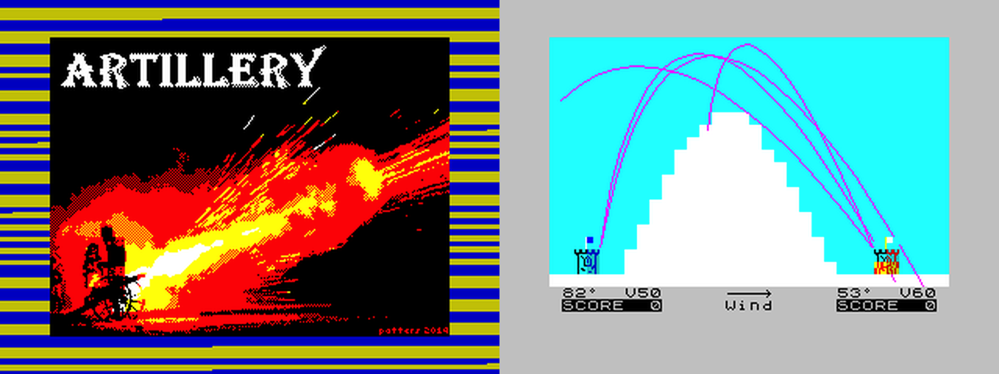
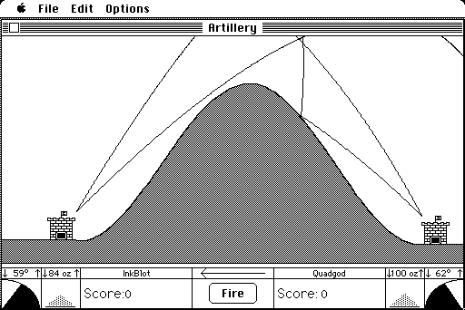

# Artillery
Projectile Motion Simulation for ZX Spectrum.

https://patters.itch.io/artillery

A BASIC demake of Artillery for Macintosh by Kirk Crawford:

> _-Excellent work around maths and physics; very elegant layout...
This could have been a perfect example of use of computers in the 80s for studying at school.
Very good work!_  
IvanBasic, worldofspectrum.org forum (BASIC coding supremo)
