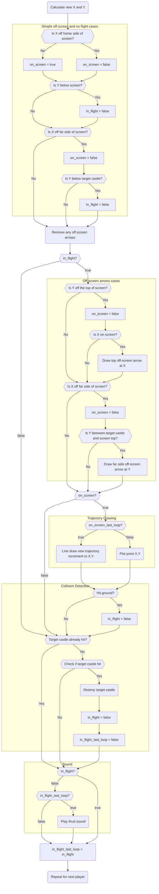

# Artillery
## Trajectory Loop Logical Flow

```mermaid
flowchart TD
    A(Calculate new X and Y)-->B{{Is X off home side of screen?}}
    subgraph OSC[Simple off-screen and no flight cases]
        B -->|No| B1[on_screen = true] --> D{{Is Y below screen?}}
        B -->|Yes| C[on_screen = false]
        C --> D
        D -->|Yes| E[in_flight = false]
        D --> |No| F{{Is X off far side of screen?}} 
        F --> |Yes| G[on_screen = false]
        G --> H{{Is Y below target castle?}}
        H -->|Yes| J[in_flight = false]
    end
    F --> |No| K
    E --> F
    H -->|No| K
    J --> K(Remove any off-screen arrows)
    K --> P{{in_flight?}}
    P -->|true| R{{Is Y off the top of screen?}}
    subgraph ARR[Off-screen arrows cases]
        R -->|Yes| S[on_screen = false]
        R -->|No| V
        S --> T{{Is X on screen?}}
        T -->|Yes| U(Draw top off-screen arrow at X)
        T -->|No| V
        U --> V{{Is X off far side of screen?}}
        V -->|Yes| V2[on_screen = false]
        V2 --> W{{Is Y between target castle and screen top?}}
        W -->|Yes| X(Draw far side off-screen arrow at Y)
    end
    P -->|false| A3
    V -->|No| Y
    W -->|No| Y{{on_screen?}}
    X --> Y
    Y -->|true| Y1{{on_screen_last_loop?}}
    Y -->|false| A3
    subgraph TD[Trajectory Drawing]
        Y1 -->|false| Z2(Plot point X,Y)
        Y1 -->|true| Z1(Line draw new trajectory increment to X,Y)
    end
    subgraph CD[Collision Detection]
        Z1 & Z2 --> A1{{Hit ground?}}
        A1 -->|Yes| A2[in_flight = false]
        A1 -->|No| A3{{Target castle already hit?}}
        A2 --> A3
        A3 -->|No| A4{{Check if target castle hit}}
        A4 -->|Yes| A5(Destroy target castle)
        A5 --> A6[in_flight = false]
        A6 --> A6B[in_flight_last_loop = false]
    end
    A3 -->|Yes| B2{{in_flight?}}
    subgraph SND[Sound]
        A4 -->|No| B2
        A6B --> B2
        B2 -->|false| C2{{in_flight_last_loop?}}
        C2 -->|true| D2(Play thud sound)
    end
    C2 -->|false| ZZ
    D2 --> ZZ[in_flight_last_loop = in_flight]
    B2 -->|true| ZZ
    ZZ --> ZZZ(Repeat for next player)
```
